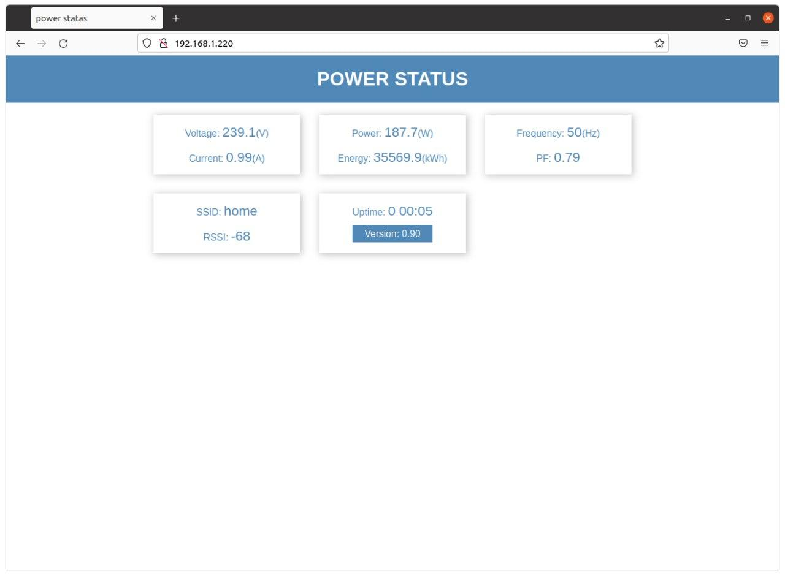
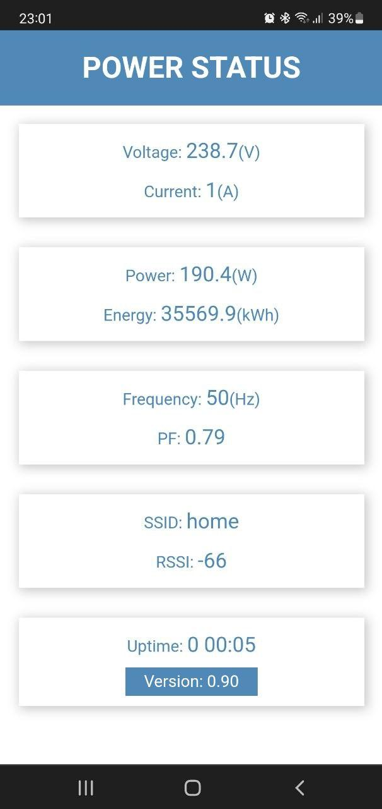

# PSTATUS

## Overview

The sketch from this repository allows you to observe the electrical parameters taken from PZEM-004T V3 module. Firmware can be built for both ESP8266 and ESP32.

## Features

Connecting PZEM-004T to ESP8266 (NODMCU V3)
```
PZEM004T(V3)   NODMCU(V3)
   1.PWR _______ 16.3V3
   2.RXD _______ 29.D1
   3.TXD _______ 28.D2
   4.GND _______ 17.GND
```
Connecting PZEM-004T to ESP32 (ESP32 DvKit V1)
```
PZEM004T(V3)  ESP32 DvKit(V1)
   1.PWR _______ 2.3V3
   2.RXD _______ 7.TX2
   3.TXD _______ 6.RX2
   4.GND _______ 1.GND
```

Data from sensors PZEM004T:

 - Voltage
 - Currency
 - Power
 - Energy
 - Frequency
 - PF

Published to mqtt broker via internal mqtt client. They can also be viewed using a browser connected to the internal Web server. Here you can also see service information.

Customizable settings such as usernames, passwords, etc. are stored on flash memory and are editable.
All variables can be changed via serial console and some via mqtt publish.

The web interface is suitable for both PC and mobile device access.
It is possible to update the firmware through a Web browser.

<p align="center"></p>

<p align="center"></p>
